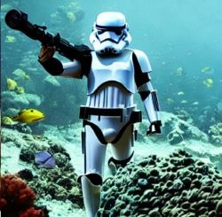

# Playing with Stable Diffusion!
**Thank you Pedro Cuenca, Patrick von Platen, Suraj Patil for the code snips and Prof Jeremy Howard for walking it through**

Check out some of the cool images from text to image and image to image prompts. 
Still got a long way to learning prompts and tuning the Stable Diffusion but I had fun with this first mini project!

  
  

