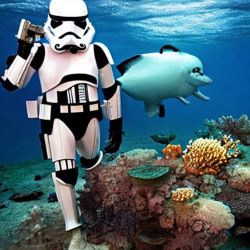

# Playing with Stable Diffusion!
**Thank you Pedro Cuenca, Patrick von Platen, Suraj Patil for the code snips and Prof Jeremy Howard for walking it through**

Check out some of the cool images from text to image and image to image prompts. 
Still got a long way to learning prompts and tuning the Stable Diffusion but I had fun with this first mini project!

- "a photograph of an stormtropper under the sea"

- "a photograph of a dog under the sea, with scuba gear"

- "potrait of a man with beard by Leonardo da Vinci"
- Well... The generation kept my pose but my face look like Da Vinci now. 
- Clearly have a lot to work on, regarding my prompts and tuning. 
